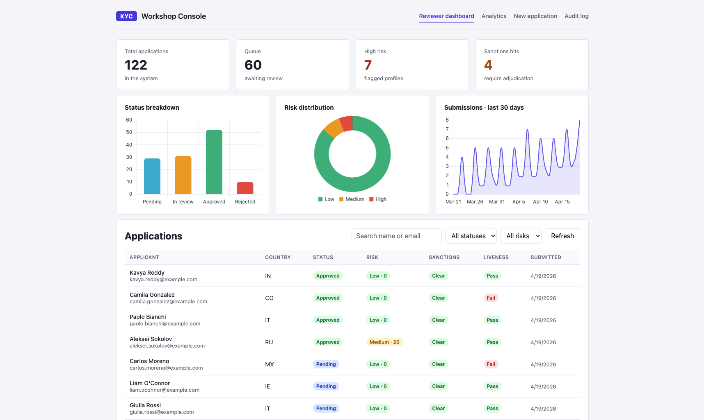

# Meridian Private Bank — Client Onboarding Console

A deliberately-simple **client-onboarding console** used as a playground for Claude Code trainings. The app ships with a fictitious private bank (*Meridian Private Bank*) and covers the three sequential stages a new client moves through: KYC verification, bank account creation, and relationship-manager assignment. This is not a production app: no external APIs, no database, no auth.

> The git repository is still named `claude-code-kyc-app` for historical reasons; the product inside is the full onboarding console.



## Stack

- **Frontend:** Vue 3 + Vite + TypeScript + Pinia + Vue Router + Chart.js (port **3000**)
- **Backend:** Python FastAPI + Uvicorn + Pydantic v2 (port **8001**)
- **Data:** In-memory store, seeded with ~120 mock applications on startup

## The onboarding journey

Every client moves through three sequential stages. The stage is surfaced two ways in the UI: as a chevron **pipeline bar** on the Overview page (counts per stage), and as a **stepper** at the top of the application detail view (where this specific client is right now).

```
┌─────────────────┐      ┌───────────────────┐      ┌──────────────────────┐      ┌────────────────┐
│ 1. KYC          │ ───▶ │ 2. Account        │ ───▶ │ 3. Relationship mgr  │ ───▶ │  Onboarded     │
│    verification │      │    creation       │      │    assignment        │      │                │
└─────────────────┘      └───────────────────┘      └──────────────────────┘      └────────────────┘
     approve / reject        pick type+currency        auto-match or pick             client active
     risk + sanctions         deposit amount           from RM pool
     + liveness               (account number
                               generated)
```

Gates between stages are enforced by the backend (409 Conflict if you try to skip ahead). A KYC **rejection** is terminal; the application stays at stage 1 with status `rejected`.

## Navigation

The console has one tab per logical space. The front page is the Overview; each stage gets its own dedicated workspace tab.

| Route | Purpose | Who it's for |
|---|---|---|
| `/` | **Overview** — pipeline bar, funnel, submissions, risk mix, top factors/countries, liveness distribution, reviewer leaderboard | All roles — the home/landing page |
| `/kyc` | **KYC queue** — filterable review queue, summary cards (pending / in-review / high-risk / sanctions hits), risk-mix donut on the current queue | Compliance reviewers |
| `/accounts` | **Account creation queue** — approved clients waiting for an account, with product suggestion + days-since-approval | Onboarding ops |
| `/rm` | **Relationship manager queue** — accounts awaiting an RM, one-click auto-assign, RM pool workload sidebar | Client-services leads |
| `/onboarding` | **New client form** — 4-step applicant capture + liveness | Clients (self-serve) |
| `/applications/:id` | **Client file** — stepper at the top, full KYC / Account / RM panels, audit trail | All roles |
| `/audit` | **Audit log** — chronological state-changing events | Compliance / risk |

## Stage-specific features

### Stage 1 — KYC verification (`/kyc`)
- Risk assessment (country, PEP, age) displayed as weighted factors
- Sanctions screening against a mock OFAC/EU/UN watchlist; re-runnable
- Deterministic liveness check (seeded on applicant email)
- Document upload with fake OCR
- Approve/reject with reviewer note (approval auto-advances to stage 2)
- Queue-level summary cards + risk donut on the current filter

### Stage 2 — Account creation (`/accounts`)
- Pick product type (checking / savings / investment), currency, initial deposit
- Backend generates a deterministic `ACCT-XXXXXXXXXX` account number
- Frontend **account-type suggestion** heuristic (in `src/utils.ts`):
  - High-risk → checking (minimize exposure)
  - Under 25 → savings (typical entry product)
  - PEP → checking until EDD clears
  - Medium-risk → savings
  - Low-risk mature → investment
- Waiting-time tracking (overdue flag after 5 days since approval)

### Stage 3 — Relationship manager (`/rm`)
- Auto-match from a 6-manager pool using risk level, account type, and country-language preference
- Manual override by picking from the pool
- Inline **1-click auto-assign** from each row in the queue
- **RM pool workload** sidebar — each manager's caseload + specialization + languages
- Overdue flag after 3 days since account opening

## Project layout

```
backend/
  requirements.txt
  requirements-dev.txt
  pytest.ini
  app/
    main.py             create_app() factory + CORS + lifespan + exception handlers
    models.py           Pydantic schemas (inputs, results, stats, stages, ManagerWithLoad)
    errors.py           Domain exceptions (ApplicationNotFound, ApplicationAlreadyDecided,
                        StageNotReachable, RelationshipManagerNotFound)
    utils.py            utcnow() helper
    store.py            In-memory application store
    audit.py            In-memory audit log
    mock_data.py        Seed data — 12 anchor cases + 40 bulk + 70 extra = ~122 applicants
    domain/             Pure domain logic (no HTTP / storage)
      risk.py
      sanctions.py
      liveness.py
      relationship_managers.py      RM pool + auto-match
    services/           Orchestration — called by the API layer
      applications.py               KYC flow + decision (auto-advances stage on approval)
      onboarding.py                 Account creation + RM assignment + RM workload
      stats.py                      Dashboard aggregates
    api/                Thin HTTP adapters, one router per resource
      health.py
      applications.py
      onboarding.py                 /account, /relationship-manager, /relationship-managers
      audit.py
      stats.py
  tests/
    conftest.py, test_risk.py, test_sanctions.py, test_liveness.py,
    test_api_applications.py, test_api_audit.py, test_api_stats.py,
    test_api_onboarding.py

frontend/
  package.json, vite.config.ts, tsconfig.json
  src/
    main.ts, App.vue, router.ts, api.ts, types.ts, styles.css, charts.ts, utils.ts
    views/
      OverviewView           workflow bar + analytics charts (home / `/`)
      KycQueueView           stage 1 workspace
      AccountQueueView       stage 2 workspace
      RmQueueView            stage 3 workspace
      OnboardingView         new-client 4-step form
      ApplicationDetailView  universal per-client detail (stepper + all stage panels)
      AuditView              global audit log
    components/
      StatusBadge, StageStepper, StageFlow,
      RiskPanel, SanctionsPanel, LivenessPanel, DocumentsPanel,
      AccountPanel, RelationshipManagerPanel
      charts/
        StatusBreakdownBar, RiskDonut, SubmissionsSparkline,
        FunnelBar, TopFactorsBar, TopCountriesBar,
        LivenessHistogram, ReviewerLeaderboard
```

## API

```
GET    /api/health
GET    /api/applications?status=&risk=&stage=&q=
POST   /api/applications                              body: ApplicantInput
GET    /api/applications/{id}
POST   /api/applications/{id}/documents               multipart: file, doc_type
POST   /api/applications/{id}/liveness                multipart: file (optional)
POST   /api/applications/{id}/sanctions               re-runs screening
POST   /api/applications/{id}/decision                body: { outcome, reviewer, note }
POST   /api/applications/{id}/account                 body: { type, currency, initial_deposit }
POST   /api/applications/{id}/relationship-manager    body: { manager_id? } — auto-match if null
GET    /api/relationship-managers                     list of { manager, assigned_count }
GET    /api/audit?application_id=
GET    /api/stats                                     aggregates for the Overview page
```

Stage gates:

- `POST /account` requires the application to be at stage `account_creation` (KYC approved). → 409 otherwise.
- `POST /relationship-manager` requires stage `rm_assignment` (account already opened). → 409 otherwise.

Full Swagger UI: http://localhost:8001/docs.

## Running

### Backend

```bash
cd backend
python -m venv .venv && source .venv/bin/activate
pip install -r requirements.txt
uvicorn app.main:app --reload --port 8001
```

### Frontend

```bash
cd frontend
npm install
npm run dev
```

Open http://localhost:3000. Vite proxies `/api/*` to the FastAPI server on 8001.

### Tests

```bash
cd backend
pip install -r requirements-dev.txt
pytest
```

46 tests covering the domain modules (risk, sanctions, liveness), the HTTP API (applications CRUD with stage/status/risk/q filters, document upload, liveness, sanctions rerun, decision flow, 404/409 error paths, audit log), the onboarding flow (stage gates, account creation, RM auto-match + manual selection, RM workload counting), and the stats endpoint.

## Seed data

On startup the backend seeds ~120 applications across all statuses and stages, spread over ~60 days so the submissions sparkline and analytics charts have shape. Restarting the backend resets the in-memory store.

Approved applicants are split across the three post-KYC stages so every queue has realistic volume:

| Stage | Count | Meaning |
|---|---|---|
| KYC | ~70 | Pending / in-review / rejected / just-approved |
| Account creation | ~11 | Approved, awaiting account opening |
| RM assignment | ~20 | Account opened, awaiting RM |
| Completed | ~21 | Fully onboarded |

Interesting seeded profiles:

- **Alice Martin** — fully onboarded (KYC approved, account opened, RM assigned).
- **Emma Johnson** — account opened, awaiting relationship-manager assignment.
- **Jiro Tanaka** — just approved, account not yet created.
- **Dmitri Ivanov** — Russian applicant flagged as PEP; medium/high risk, still at KYC.
- **Hassan Karimi** — residence in Iran, rejected with reviewer note.
- **Ivan Volkov** — exact match on the fake OFAC watchlist; sanctions hit.
- **Chen Wei / Maria Delacroix** — partial-name matches on the UK HMT / EU mock lists.

## Workshop hooks

Because every piece is small and stubbed, there are many natural exercises:

- Add a new risk factor (e.g., mismatched nationality vs. document country) in `domain/risk.py`.
- Swap the mock sanctions list for a CSV import.
- Move the account-type suggestion from `frontend/src/utils.ts` into a proper backend endpoint under `domain/accounts.py`.
- Add a new account type (e.g., `joint_account`) and wire it through backend + frontend.
- Extend the RM matcher — e.g., capacity limits per manager, working-hours matching, round-robin fallback.
- Add a 4th stage (e.g., "welcome kit dispatched") and thread it through stage gates, stepper, pipeline bar, and stats.
- Add reviewer authentication / roles.
- Extend the pytest suite with new scenarios (sanctions edge cases, reviewer permission checks, per-stage queue endpoints).
- Add E2E tests with Playwright driving the full onboarding journey.
- Add a new chart to the Overview page (e.g., time-to-decision by risk tier, stage throughput).

## Not implemented on purpose

- Real sanctions APIs (OpenSanctions, OFAC feeds) — they require accounts or bulk downloads.
- File persistence — uploaded bytes are inspected for size but not stored.
- Authentication — the `reviewer` field is freely editable in the UI.
- Encryption / PII redaction — this is a training app, do not put real data in it.
- Real account ledger, card issuance, KYC-refresh cycles, client-lifecycle events. The three stages stop at RM assignment; there is no "ongoing servicing" flow.
